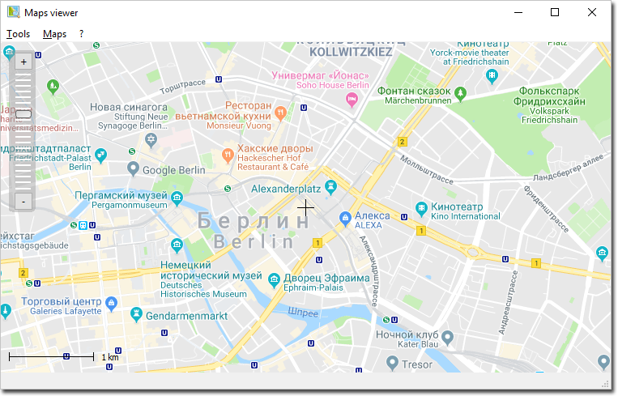
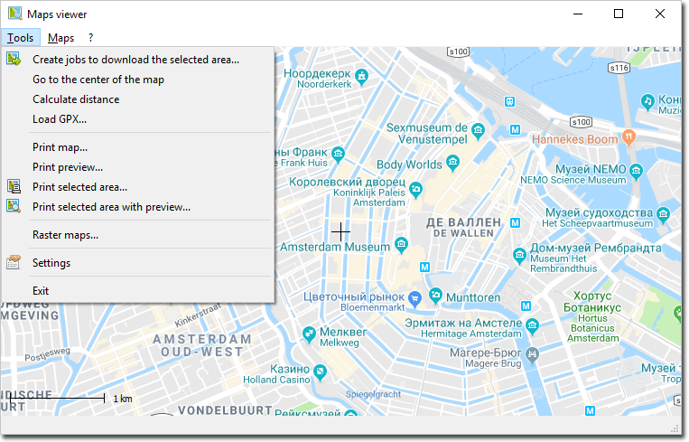

# QNetMap

QNetMap is the library that let you embed maps into your Qt applications. With the 
help of QNetMap you can:
* display a map with multiple map layers;
* pan and zoom throughout a map;
* draw graphics features such as points, lines, ellipses, rectangles, polygons, and user-defined shapes;
* draw descriptive text;
* identify features on a map by pointing at them etc.

The project is originally based on the QMapControl library (https://sourceforge.net/projects/qmapcontrol/) 
by Kai Winter. To show the map QNetMap can use different providers like OpenStreetMap 
or other WMS servers. The map data can be loaded from the Internet or from the 
disk cache. User's own raster maps can also be used.

QNetMap supports layers so you can mix maps from different servers. To enrich the map 
presentation you can draw your own objects in the given coordinates.

### Screenshots

### License

QNetMap is distributed under the GNU Lesser General Public License (LGPL).

### Authors

Written by Sergey Shumeyko (sergey.shumeyko [at] gmail.com) and Sergey Vasyutin 
(sergey [at] vasyut.in).

The development of the library was supported by the "Sintels" LLC (ЗАО "Синтелс" - 
http://sintels.ru) and OJSC "T8" (ОАО "Т8" - https://t8.ru). 

